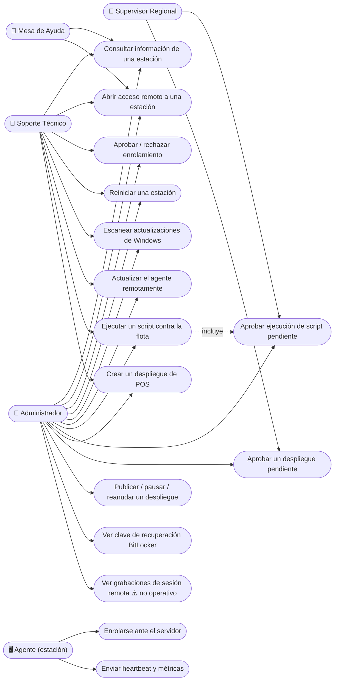
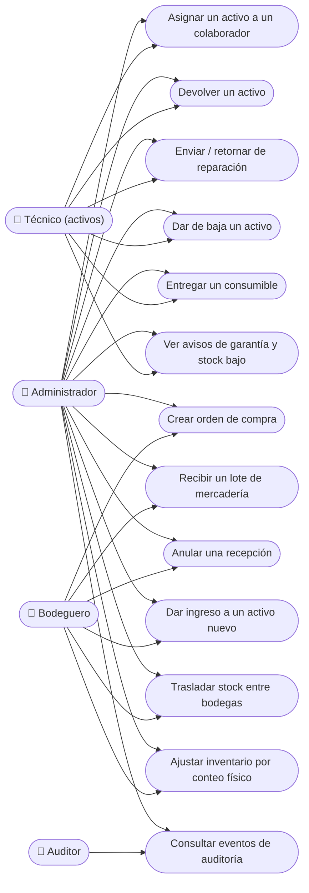
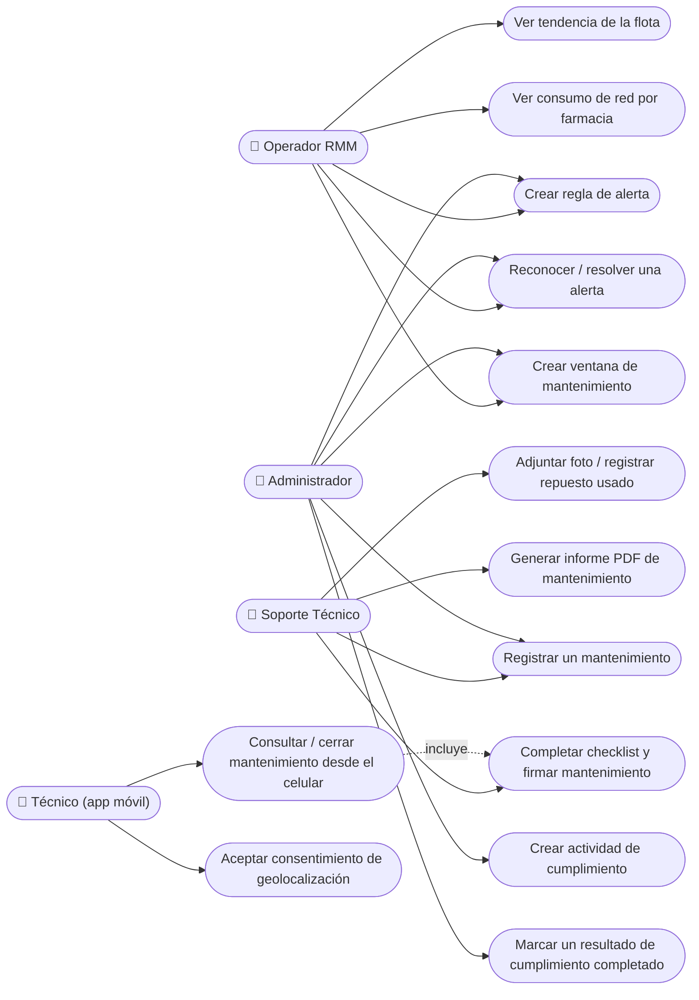
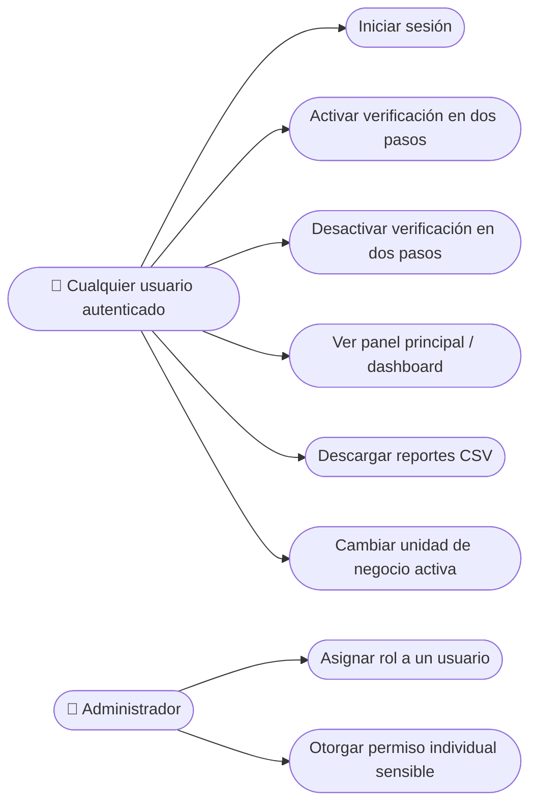

# Diagrama y Fichas de Casos de Uso — SAIDSOFT

> Nota de notación: Mermaid (el motor de diagramas usado en este documento) no tiene un
> tipo de diagrama UML de casos de uso nativo (con actor "monigote" y óvalos). Se
> aproxima con `flowchart`: el actor es un nodo rectangular con icono de persona (▭), y
> cada caso de uso es un nodo ovalado (`([texto])`). La semántica (actor -- asociación
> -- caso de uso) es la misma que un diagrama UML de casos de uso estándar.

## Actores del sistema

| Actor | Tipo | Descripción |
|---|---|---|
| **Administrador** | Humano | Acceso total al sistema |
| **Soporte Técnico** | Humano | Segunda línea de soporte de campo (9 técnicos reales + 2 supervisores regionales) |
| **Mesa de Ayuda** | Humano | Primera línea de soporte (solo diagnóstico, sin acciones de riesgo) |
| **Técnico (activos)** | Humano | Gestión de campo de activos/inventario |
| **Bodeguero** | Humano | Encargado de bodega y compras |
| **Auditor** | Humano | Control interno, solo lectura + supervisión de grabaciones |
| **Operador RMM** | Humano | Gestión de scripts y monitoreo de flota |
| **Supervisor Regional** | Humano | Soporte Técnico + aprobación de scripts/despliegues de su equipo (permiso individual) |
| **Agente (estación)** | Sistema externo | Software instalado en cada PC de farmacia; se comunica por MQTT |
| **Worker MQTT** | Sistema interno | Procesa mensajes del agente y los traduce a cambios de estado |

---

## Diagrama 1 — Estaciones, Scripts y Despliegues (soporte técnico)

## Diagrama 2 — Activos e Inventario

## Diagrama 3 — Monitoreo, Cumplimiento y Mantenimiento

## Diagrama 4 — Cuentas y Seguridad (todos los roles)

---

## Fichas detalladas de casos de uso

### UC-03 — Aprobar o rechazar el enrolamiento de una estación

| | |
|---|---|
| **Actor principal** | Soporte Técnico / Administrador |
| **Actor secundario** | Agente (estación) |
| **Precondición** | El agente se instaló en un equipo y se enroló; existe una `Estación` en estado *Pendiente* |
| **Flujo principal** | 1. El usuario abre *Estaciones → Pendientes*. 2. Revisa el código, hostname y farmacia reportados. 3. Presiona *Aprobar*. 4. El sistema cambia `estado_aprobacion` a *Aprobada* y registra el evento en auditoría. |
| **Flujo alternativo — rechazo** | En el paso 3, el usuario presiona *Rechazar* en su lugar → `estado_aprobacion` pasa a *Rechazada*; la estación no podrá enviar heartbeats ni recibir comandos. |
| **Flujo alternativo — aprobación en lote** | El usuario selecciona varias estaciones pendientes a la vez y aprueba todas en un solo paso. |
| **Postcondición** | Solo una estación *Aprobada* procesa heartbeats, métricas y comandos del panel. |

### UC-07 / UC-08 — Ejecutar un script contra la flota (con aprobación de cuatro ojos)

| | |
|---|---|
| **Actor principal** | Soporte Técnico (crea) / Supervisor Regional o Administrador (aprueba) |
| **Precondición** | Existe un `Script` en la biblioteca (o se escribe uno ad-hoc) |
| **Flujo principal** | 1. El usuario elige un script y un destino (Cadena, Grupos, Farmacias o Estaciones). 2. Si el destino es Cadena, Grupos o Farmacias, la ejecución queda *Pendiente de aprobación* y **no** se envía todavía. 3. Una persona **distinta** de quien la creó revisa la ejecución y la aprueba. 4. El sistema resuelve la lista real de estaciones del destino (siempre dentro de la misma unidad de negocio) y publica el comando por MQTT a cada una. 5. Cada estación reporta su resultado (pendiente → enviado → ejecutando → completado/error). |
| **Flujo alternativo — destino Estaciones** | Si el destino son estaciones puntuales, se publica de inmediato sin pasar por aprobación (destino ya acotado). |
| **Flujo alternativo — autoaprobación bloqueada** | Si quien intenta aprobar es la misma persona que creó la ejecución, el sistema rechaza la acción con un mensaje de error explícito. |
| **Excepción sin aprobación** | Las ejecuciones generadas automáticamente por un *Script programado* ya vencido no vuelven a pedir aprobación (la política ya se aprobó una vez al crearse). |
| **Postcondición** | La ejecución queda con resultado por estación, visible en su ficha de detalle. |

### UC-09 / UC-10 / UC-11 — Desplegar una actualización de POS

| | |
|---|---|
| **Actor principal** | Soporte Técnico / Administrador (crea); otra persona distinta (aprueba) |
| **Precondición** | Se cuenta con el paquete `.zip` versionado del POS |
| **Flujo principal** | 1. Se sube el paquete, se define versión, modo de aplicación (inmediato / ventana / cierre de POS) y destino. 2. El despliegue nace **siempre** en *Pendiente de aprobación*, sin excepción. 3. Otra persona lo aprueba (regla de cuatro ojos, igual que en scripts). 4. Se publica por MQTT; cada estación pasa por: publicado → recibido → descargado → hash verificado → (si aplica) POS cerrado → aplicado → POS relanzado → OK. 5. Si el % de estaciones con error supera el umbral configurado, el despliegue se **pausa automáticamente**. |
| **Flujo alternativo — reanudar tras freno** | El operador reanuda a propósito el despliegue pausado; queda marcado que el freno se omitió para no repetirse por el mismo motivo. |
| **Flujo alternativo — promoción por anillos** | Un despliegue completado en un destino angosto puede promoverse al siguiente anillo (destino más amplio) con el mismo paquete. |
| **Postcondición** | Cada estación del destino queda en la versión de POS desplegada, con una línea de tiempo inmutable de lo que pasó. |

### UC-12 — Ver la clave de recuperación de BitLocker

| | |
|---|---|
| **Actor principal** | Persona autorizada individualmente (no por rol/grupo) |
| **Precondición** | La estación reportó su clave de recuperación al menos una vez (queda guardada cifrada) |
| **Flujo principal** | 1. El usuario abre la ficha de la estación. 2. Presiona *Ver clave BitLocker*. 3. El sistema descifra la clave bajo demanda y la muestra. 4. Queda registrado en auditoría quién la consultó y cuándo. |
| **Postcondición** | La clave se mostró una vez en pantalla; el evento queda auditado permanentemente. |

### UC-13 — Ver grabaciones de sesión remota ⚠️ (no operativo en producción)

| | |
|---|---|
| **Actor principal** | Auditor, o persona autorizada puntualmente |
| **Estado real** | El botón y el permiso (`catalogo.supervision_auditoria_estacion`) existen en el panel, pero **no funciona hoy contra producción**. |
| **Por qué** | El link solo abre la ficha general del equipo en MeshCentral (no hay deep-link directo a una lista de grabaciones por estación) — y la grabación de sesión en sí **nunca se activó** en el servidor MeshCentral real. Requiere agregar el bloque `sessionRecording` a `config.json` y marcar el grupo de dispositivos para grabación desde la consola de MeshCentral; eso solo se probó en un contenedor de prueba aparte, nunca en el `docker-compose.yml` que corre en producción. |
| **Pendiente para que funcione** | Aplicar la configuración de `sessionRecording` al MeshCentral real, marcar "Estaciones SAIDSOFT" para grabación, y validar de punta a punta (grabar → listar → reproducir) con una estación piloto. |

### UC-23...UC-27 — Ciclo de vida de un Activo

| | |
|---|---|
| **Actor principal** | Bodeguero (ingreso) / Técnico de activos o Soporte Técnico (resto del ciclo) |
| **Precondición** | Existe una Orden de Compra recibida, o el activo ya está en bodega |
| **Flujo principal** | 1. **Ingreso**: se registra el activo nuevo (código autogenerado, estado *En bodega*). 2. **Asignación**: se asigna a un colaborador (estado *Asignado*). 3. **Devolución**: el colaborador lo devuelve; si necesita reparación pasa a *En reparación*, si no vuelve a *En bodega*. 4. **Baja**: en cualquier momento (salvo si ya está de baja) se puede dar de baja con un motivo (destrucción, obsolescencia, robo/pérdida, donación). |
| **Restricción de negocio** | No se puede asignar un activo que no esté *En bodega*; no se puede dar de baja un activo que ya está de baja. |
| **Postcondición** | El activo nunca se elimina del sistema — cada cambio de estado queda en su historial de eventos, inmutable. |

### UC-21 / UC-22 — Recibir y anular una recepción de mercadería

| | |
|---|---|
| **Actor principal** | Bodeguero |
| **Precondición** | Existe una Orden de Compra con líneas pendientes de recibir |
| **Flujo principal** | 1. Se registra la recepción de un lote sobre una línea de la orden (cantidad recibida). 2. Si es consumible, la cantidad entra al stock de la bodega destino. 3. La línea y la orden actualizan su estado (parcial/completo) automáticamente. |
| **Flujo alternativo — anulación** | Se anula una recepción registrada por error: se revierte la cantidad de la línea y del stock (validando que no se haya consumido ya), sin borrar el historial — la recepción queda marcada *Anulada*. |
| **Postcondición** | El stock y el estado de la orden reflejan exactamente lo realmente recibido y vigente. |

### UC-51 / UC-52 — Gestionar un mantenimiento desde la app móvil del técnico

| | |
|---|---|
| **Actor principal** | Técnico (app móvil) |
| **Precondición** | El técnico tiene un token de acceso a la API; el mantenimiento le está asignado |
| **Flujo principal** | 1. El técnico consulta sus mantenimientos asignados desde el celular. 2. Inicia uno, completa el checklist, adjunta fotos y registra repuestos usados. 3. Firma digitalmente (custodio y/o técnico) y cierra el mantenimiento. 4. Si se registró la ubicación GPS, primero debe haber aceptado el consentimiento de geolocalización explícito — sin eso, el registro de ubicación se rechaza. |
| **Restricción de negocio** | El técnico solo ve y opera sobre sus propios mantenimientos, nunca los de otro técnico. |
| **Postcondición** | El mantenimiento queda cerrado con checklist, firma, evidencia fotográfica y, opcionalmente, informe en PDF generado. |

### UC-61 — Activar verificación en dos pasos (MFA)

| | |
|---|---|
| **Actor principal** | Cualquier usuario autenticado |
| **Precondición** | El usuario inició sesión con su contraseña |
| **Flujo principal** | 1. El usuario entra a *Verificación en dos pasos* y ve un código QR. 2. Lo agrega a una app autenticadora (o carga la clave manual). 3. Ingresa el código de 6 dígitos generado para confirmar. 4. El sistema activa el dispositivo y lo exige desde el próximo login. |
| **Postcondición** | Desde ese momento, el login de ese usuario exige contraseña **y** código de 6 dígitos. |

### UC-14 / UC-15 — El agente se enrola y reporta heartbeat (actor: Agente)

| | |
|---|---|
| **Actor principal** | Agente (estación) |
| **Actor secundario** | Worker MQTT |
| **Precondición** | El agente está instalado y configurado con la URL del broker MQTT |
| **Flujo principal** | 1. El agente publica su código, identificador de hardware y datos básicos de equipo. 2. El servidor verifica que la farmacia del código exista; si no, rechaza. 3. Si existe, crea la estación en estado *Pendiente* y responde con un token de enrolamiento y credenciales MQTT propias. 4. Una vez aprobada por un humano (UC-03), el agente empieza a enviar heartbeats periódicos y métricas. |
| **Flujo alternativo — reenrolamiento** | Si el agente perdió su identidad local, vuelve a enrolarse con el mismo código; el sistema valida que el identificador de hardware coincida con el ya guardado — si no coincide, rechaza y exige reaprobación manual (protección contra suplantación). |
| **Postcondición** | La estación queda con `estado_conexion = Online` mientras siga enviando heartbeats dentro del umbral configurado. |
