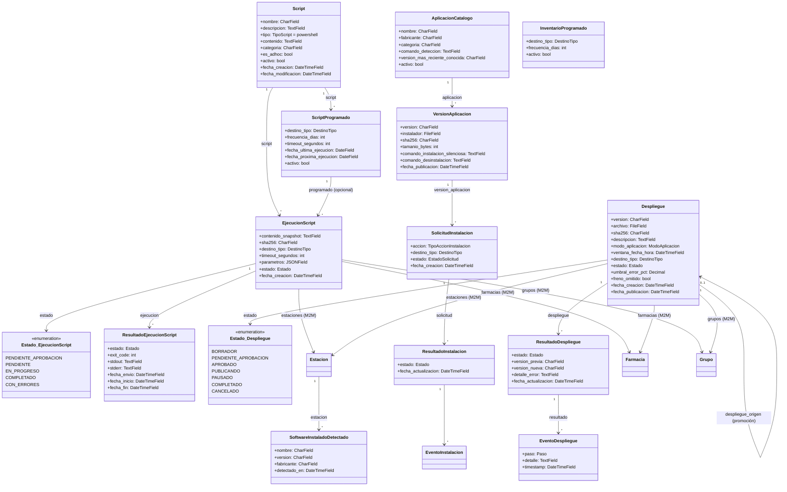
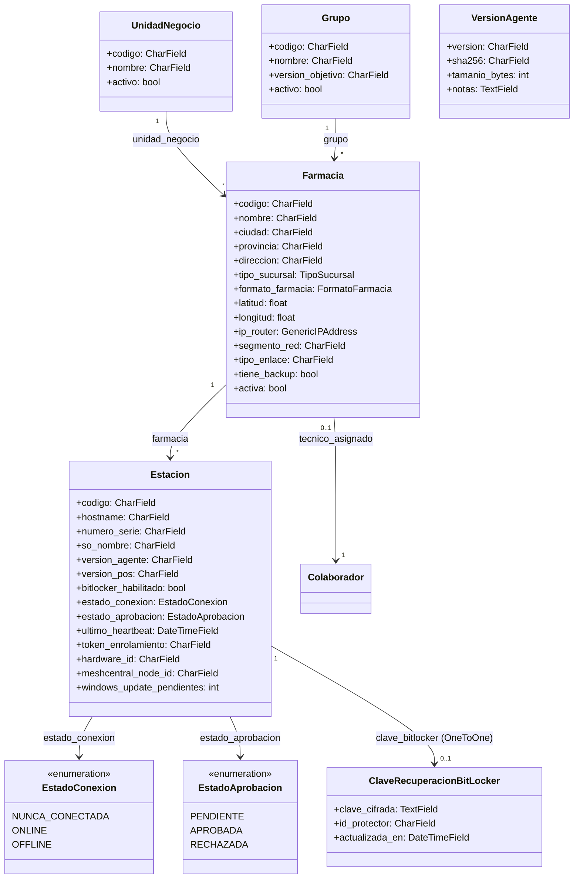
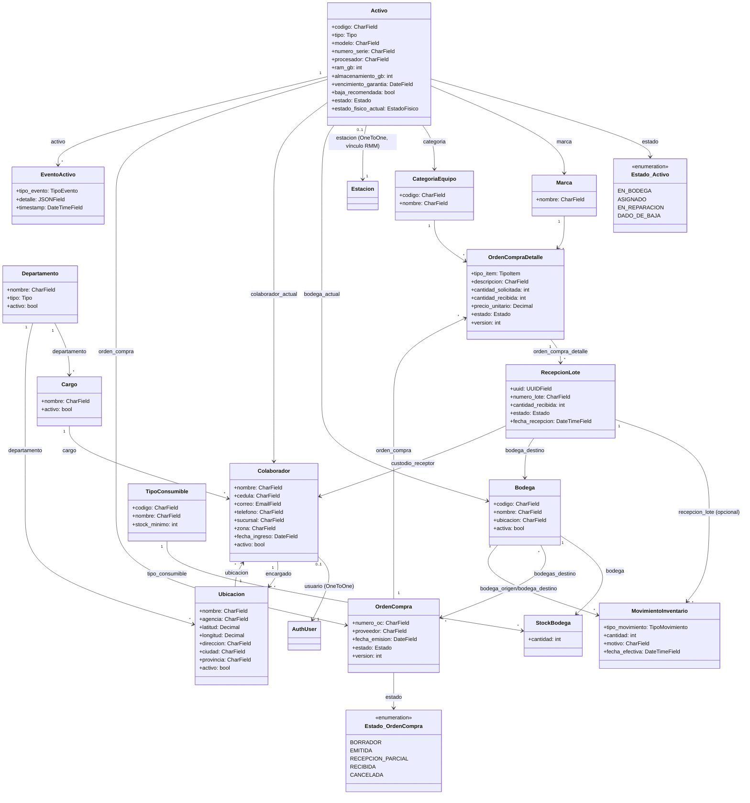
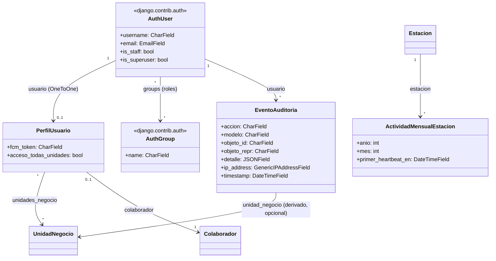

# Diagrama de Clases — SAIDSOFT

Dado el tamaño del sistema (más de 30 modelos en ~10 apps Django), el diagrama se separa
por dominio funcional en vez de un único diagrama monolítico ilegible. Cada bloque usa
sintaxis Mermaid `classDiagram` y puede pegarse tal cual en cualquier visor compatible
(GitHub, GitLab, VS Code con extensión Mermaid, mermaid.live).

---

## Dominio: Scripts, Despliegues y Software

*(`Estacion`, `Farmacia`, `Grupo`, `UnidadNegocio` se detallan en el dominio "Catálogo y
Estaciones" — se repiten acá solo como referencia de relación.)*

---

## Dominio: Catálogo y Estaciones

Este es el dominio raíz del sistema — casi todos los demás dominios cuelgan de
`UnidadNegocio`, `Farmacia` o `Estacion`.

**Permisos custom sobre `Estacion`** (no son CRUD estándar, se otorgan aparte):
`acceso_remoto_estacion`, `supervision_auditoria_estacion`, `ver_clave_bitlocker`,
`consultar_info_estacion`, `aprobar_estacion`, `reiniciar_estacion`,
`escanear_actualizaciones_estacion`, `actualizar_agente_estacion`.

## Dominio: Monitoreo, Cumplimiento y Mantenimiento

```mermaid
classDiagram
    class MuestraMetrica {
        +cpu_carga_pct: float
        +ram_usada: int
        +disco_libre_gb: float
        +temperatura_c: float
        +latencia_ms: float
        +red_recibido_kbps: float
        +red_enviado_kbps: float
        +timestamp: DateTimeField
    }
    class MuestraRedFarmacia {
        +bytes_recibidos: BigInt
        +bytes_enviados: BigInt
        +red_recibido_kbps: float
        +red_enviado_kbps: float
        +timestamp: DateTimeField
    }
    class ReglaAlerta {
        +nombre: CharField
        +metrica: Metrica
        +operador: Operador
        +umbral: float
        +duracion_minutos: int
        +severidad: Severidad
        +activo: bool
    }
    class Alerta {
        +estado: Estado
        +valor_disparador: float
        +abierta_en: DateTimeField
        +reconocida_en: DateTimeField
        +resuelta_en: DateTimeField
        +escalada_en: DateTimeField
    }
    class Estado_Alerta {
        <<enumeration>>
        ABIERTA
        RECONOCIDA
        RESUELTA
    }
    class VentanaMantenimiento {
        +destino_tipo: DestinoTipo
        +desde: DateTimeField
        +hasta: DateTimeField
        +motivo: CharField
        +activo: bool
    }
    class CanalNotificacion {
        +tipo: Tipo
        +destino: URLField
        +activo: bool
    }
    class ActividadCumplimiento {
        +nombre: CharField
        +tipo_objetivo: TipoObjetivo
        +fecha_limite: DateField
    }
    class ResultadoCumplimientoEstacion {
        +estado: EstadoCumplimiento
        +fecha_completado: DateTimeField
        +observacion: CharField
    }
    class Mantenimiento {
        +descripcion: TextField
        +tipo_origen: TipoOrigen
        +estado_interno: EstadoInterno
        +resultado_tecnico: ResultadoTecnico
        +estado_general: EstadoGeneralEquipo
        +fecha_programada: DateTimeField
        +fecha_cierre: DateTimeField
        +informe_pdf: FileField
    }
    class MantenimientoProgramado {
        +frecuencia_dias: int
        +fecha_ultimo: DateField
        +fecha_proximo: DateField
        +activo: bool
    }
    class RepuestoUtilizado {
        +cantidad: int
        +costo_unitario: Decimal
    }
    class FirmaMantenimiento {
        +tipo_firma: TipoFirma
        +firma_base64: TextField
        +firmado_en: DateTimeField
    }
    class ActividadPlanificada {
        +titulo: CharField
        +prioridad: Prioridad
        +estado: Estado
        +fecha_inicio: DateTimeField
        +fecha_fin: DateTimeField
    }
    class SoftwareInstaladoDetectado {
        +nombre: CharField
        +version: CharField
        +detectado_en: DateTimeField
    }
    class AplicacionCatalogo {
        +nombre: CharField
        +version_mas_reciente_conocida: CharField
    }

    Estacion "1" --> "*" MuestraMetrica : estacion
    Farmacia "1" --> "*" MuestraRedFarmacia : farmacia
    UnidadNegocio "1" --> "*" ReglaAlerta : unidad_negocio (opcional)
    ReglaAlerta "1" --> "*" Alerta : regla
    Estacion "1" --> "*" Alerta : estacion
    Alerta --> Estado_Alerta : estado
    UnidadNegocio "1" --> "*" VentanaMantenimiento : unidad_negocio
    UnidadNegocio "1" --> "*" CanalNotificacion : unidad_negocio (opcional)

    ActividadCumplimiento "1" --> "*" ResultadoCumplimientoEstacion : actividad
    Estacion "1" --> "*" ResultadoCumplimientoEstacion : estacion

    Activo "*" --> "*" Mantenimiento : equipo (vía MantenimientoEquipo)
    Colaborador "1" --> "*" Mantenimiento : cliente
    Mantenimiento "1" --> "*" RepuestoUtilizado : mantenimiento
    Mantenimiento "1" --> "*" FirmaMantenimiento : mantenimiento
    MantenimientoProgramado "1" --> "*" Mantenimiento : mantenimiento_programado (opcional)
    Activo "1" --> "*" MantenimientoProgramado : equipo
    ActividadPlanificada --> Mantenimiento : mantenimiento (opcional)

    Estacion "1" --> "*" SoftwareInstaladoDetectado : estacion
    AplicacionCatalogo "1" --> "*" VersionAplicacion : aplicacion
```

*(`Activo`/`Colaborador` se detallan en el dominio "Activos e Inventario";
`VersionAplicacion` en el dominio "Scripts, Despliegues y Software".)*

## Dominio: Activos e Inventario

*(`AuthUser` = `django.contrib.auth.User`; `Estacion` se detalla en el dominio
"Catálogo y Estaciones".)*

## Dominio: Cuentas, Auditoría y Facturación

*(`UnidadNegocio`/`Estacion` se detallan en el dominio "Catálogo y Estaciones";
`Colaborador` en el dominio "Activos e Inventario". `AuthGroup` es el mecanismo real
de "rol" del sistema — no existe un modelo `Rol` propio.)*
